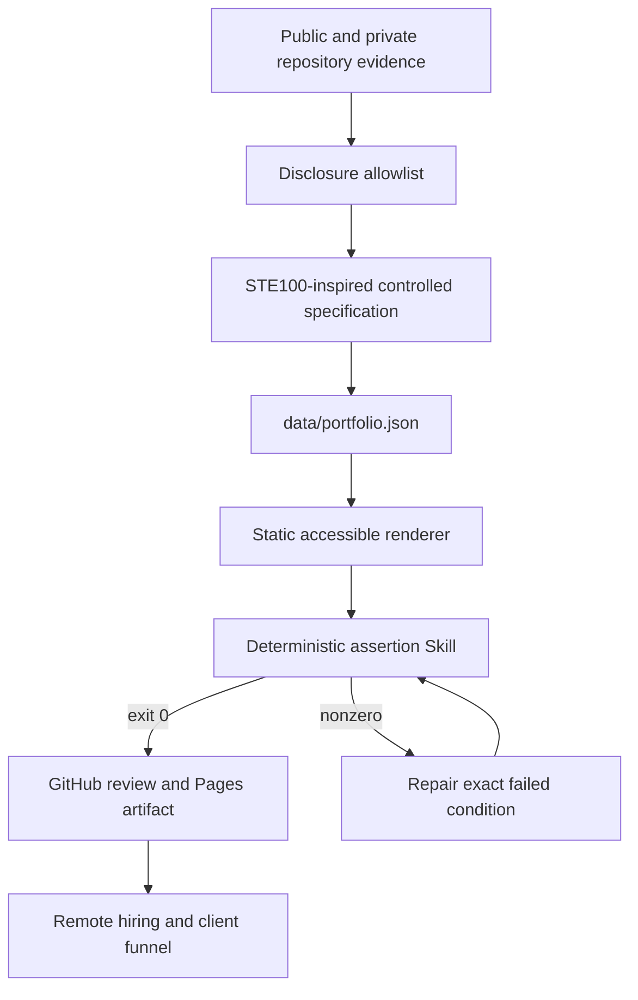

# Eeon — Drop-in Remote Agent Engineer

[](https://github.com/ed3c/skill-resume-site/actions/workflows/ci.yml)
[](https://github.com/ed3c/skill-resume-site/actions/workflows/pages.yml)
[](LICENSE)

**Live portfolio:** `https://ed3c.github.io/skill-resume-site/`

Android systems depth. Full-stack delivery. Agentic verification.

This repository is a public, evidence-backed online résumé for:

- Agentic Architect roles;
- remote FDE engagements;
- applied AI Engineer roles;
- part-time, fully remote delivery through a personal studio.

The preferred commercial model is a 50% kickoff payment, followed by biweekly review and settlement against accepted evidence.

## Why now

Code generation is abundant. Reliable execution still requires a system around the model:

```text
controlled specification
→ reusable Skill
→ bounded tool access
→ code execution
→ deterministic assertions
→ repair
→ evidence receipt
→ reviewable delivery
```

The site applies the YC-style narrative of a specific problem, a clear timing shift, live proof, and a business path. It does not claim endorsement by Y Combinator.

## Public disclosure boundary

The public résumé lists transferable methods and open technologies.

The public résumé does **not** publish:

- employer, customer, or current-company information;
- credentials, device identifiers, signing material, or private data;
- proprietary source, private domain rules, or commercial adapter inventory;
- unsupported performance, production, hardware, GPU, or customer claims.

Private repositories appear only as sanitized capability summaries. See [`docs/disclosure-policy.md`](docs/disclosure-policy.md).

## Evidence status, not invented percentages

Capability completion uses explicit states:

| State | Meaning |
|---|---|
| `Verified public` | Public implementation with executable checks or recorded evidence |
| `Public prototype` | Public architecture and working product path; production claims remain limited |
| `Deterministic reference` | Local, repeatable reference behavior; live provider or hardware claims are excluded |
| `Private implementation` | Implementation exists privately; only sanitized capability information is public |
| `Next proof` | A concrete missing evidence item required for the next role level |

## Architecture



The controlled-language style borrows principles such as explicit nouns, short instructions, and one action per step. This is **not** an official ASD-STE100 conformance claim.

## Directory structure

```text
skill-resume-site/
├── index.html
├── 404.html
├── assets/
│   ├── styles.css
│   ├── app.js
│   └── favicon.svg
├── data/
│   └── portfolio.json
├── docs/
│   ├── architecture.md
│   ├── disclosure-policy.md
│   └── stack-plan.md
├── .agents/skills/
│   └── portfolio-evidence/
│       ├── SKILL.md
│       ├── scripts/assert-site.mjs
│       └── references/evidence-contract.md
├── .github/
│   ├── ISSUE_TEMPLATE/project-inquiry.yml
│   └── workflows/
│       ├── ci.yml
│       └── pages.yml
├── AGENTS.md
├── CONTEXT.md
├── SECURITY.md
├── package.json
└── README.md
```

## Small loop versus Anthropic Evaluator–Optimizer

Anthropic's Evaluator–Optimizer workflow uses one model to generate and another model call to evaluate and return feedback.

This repository specializes that pattern for software delivery:

```text
SPEC
→ SMALLEST CHANGE
→ EXECUTE
→ DETERMINISTIC ASSERT
    ├── PASS → EVIDENCE RECEIPT → PR
    └── FAIL → EXACT DIAGNOSTIC → REPAIR → RERUN
```

The main evaluator is mechanical: parsers, schema checks, policy checks, link checks, syntax checks, and CI exit codes. An LLM critique can assist. An LLM critique cannot create release truth.

## SKILL.md execution contract

The bundled Skill requires the agent to:

1. read `AGENTS.md`, `CONTEXT.md`, and the evidence contract;
2. define one bounded outcome;
3. map each public claim to evidence and a status;
4. apply the smallest reviewable change;
5. run `npm run check`;
6. parse a nonzero exit and repair the exact failure;
7. rerun until all assertions pass;
8. publish the code, remaining risks, and evidence.

## Git Town molecular delivery plan

```text
main
└── portfolio/foundation
    └── portfolio/evidence
        └── portfolio/agentic-loop
```

| Branch | Single responsibility |
|---|---|
| `portfolio/foundation` | Accessible static shell, responsive UI, and Pages workflow |
| `portfolio/evidence` | Public/private evidence model, role progress, and disclosure policy |
| `portfolio/agentic-loop` | SKILL.md, assertions, small-loop comparison, and traceability |

Dependent work is stacked. Independent work remains a sibling branch. See [`docs/stack-plan.md`](docs/stack-plan.md).

## Local verification

Requirements:

- Node.js 20 or newer
- Python 3 for the optional local server

Run:

```bash
npm run check
python3 -m http.server 4173
```

Open `http://localhost:4173`.

The checker validates:

- required files and sections;
- JSON schema shape and unique project IDs;
- allowed evidence states;
- public links and private-link boundaries;
- prohibited disclosure terms and secret patterns;
- local asset references;
- one-action English delivery steps;
- JavaScript syntax.

## GitHub Pages

The Pages workflow verifies the repository, creates a minimal `_site` artifact, and deploys it with GitHub's official Pages actions.

The repository owner must select **GitHub Actions** as the Pages source once if it is not already enabled.

## Reference basis

- [Anthropic Evaluator–Optimizer](https://platform.claude.com/cookbook/patterns-agents-evaluator-optimizer)
- [Anthropic Agent Skills](https://platform.claude.com/docs/en/agents-and-tools/agent-skills/overview)
- [ASD-STE100 official site](https://www.asd-ste100.org/)
- [Git Town stacked changes](https://www.git-town.com/stacked-changes)
- [Y Combinator: How to Apply](https://www.ycombinator.com/howtoapply)
- [GitHub Pages custom workflows](https://docs.github.com/en/pages/getting-started-with-github-pages/using-custom-workflows-with-github-pages)

## License

MIT
