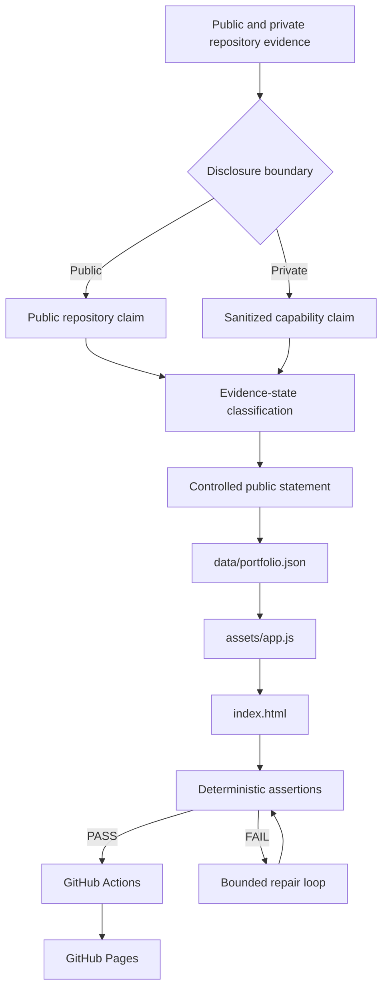
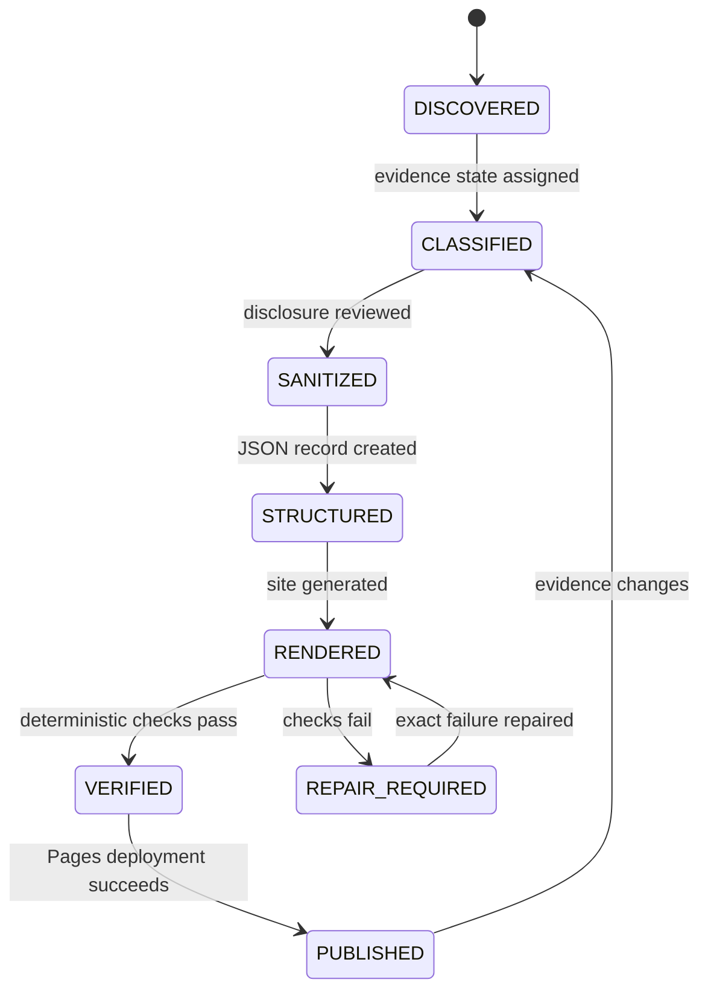
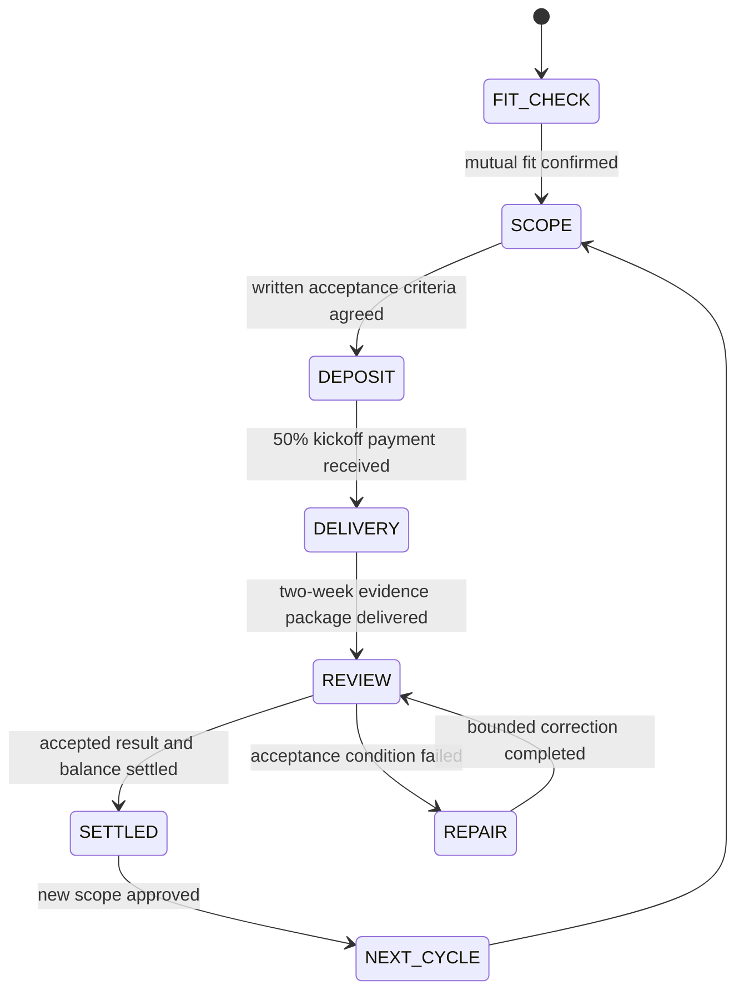

# Portfolio Architecture

## Purpose

The site converts repository evidence into a public, controlled, and reviewable résumé. It separates technical truth, disclosure decisions, presentation, and publication.

## Evidence data flow



## Content state machine



## Engagement state machine



## Component responsibility

| Path | Responsibility | Must not own |
|---|---|---|
| `data/portfolio.json` | Claims, statuses, summaries, stack labels | Rendering logic |
| `assets/app.js` | Filtering, language selection, safe rendering | Technical claim authority |
| `index.html` | Page structure and one-time narrative | Repeated project records |
| `assets/styles.css` | Visual system and responsive behavior | Content truth |
| `assert-site.mjs` | Deterministic publication rules | Human disclosure approval |
| `docs/disclosure-policy.md` | Public/private boundary | Runtime secrets |
| GitHub Actions | Execute checks and deploy | Semantic proof by itself |

## Loop boundary

The portfolio uses a small engineering loop:

```text
specify
-> change
-> execute
-> assert
-> repair exact failure
-> rerun
-> publish evidence
```

The loop differs from a general evaluator-optimizer pattern. It uses deterministic commands and explicit exit codes for machine-checkable conditions. Human review remains the authority for disclosure and commercial fit.

## Failure policy

- Do not convert `ABSENT` into `PASS`.
- Do not claim private implementation as public code.
- Do not add quantitative impact without a source, method, scope, and date.
- Do not bypass a failing assertion to publish the site.
- Stop after three identical repair failures and report the blocker.
